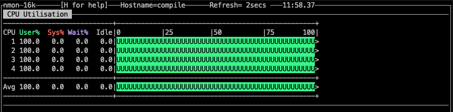
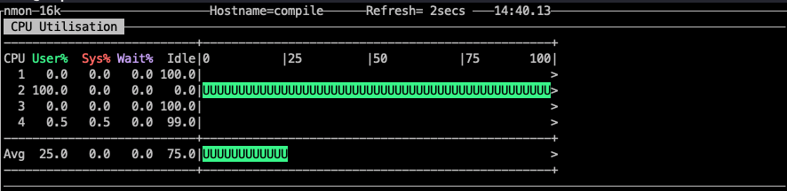
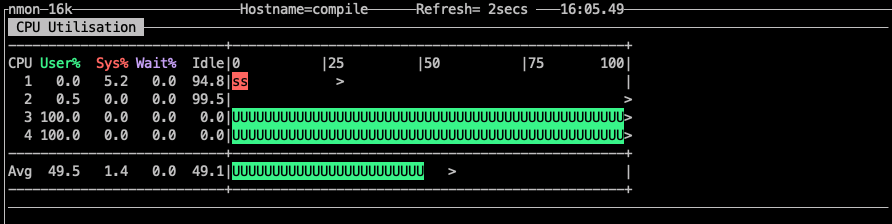

# 文盘Rust -- tokio绑定cpu实践

tokio 是 rust 生态中流行的异步运行时框架。在实际生产中我们如果希望 tokio 应用程序与特定的 cpu core 绑定该怎么处理呢？这次我们来聊聊这个话题。

首先我们先写一段简单的多任务程序。

```rust
use tokio::runtime;
pub fn main() {
    let rt = runtime::Builder::new_multi_thread()
        .enable_all()
        .build()
        .unwrap();

    rt.block_on(async {
        for i in 0..8 {
            println!("num {}", i);
            tokio::spawn(async move {
                loop {
                    let mut sum: i32 = 0;
                    for i in 0..100000000 {
                        sum = sum.overflowing_add(i).0;
                    }
                    println!("sum {}", sum);
                }
            });
        }
    });
}
```

程序非常简单，首先构造一个tokio runtime 环境，然后派生多个 tokio 并发，每个并发执行一个无限循环做overflowing_add。overflowing_add函数返回一个加法的元组以及一个表示是否会发生算术溢出的布尔值。如果会发生溢出，那么将返回包装好的值。然后取元祖的第一个元素打印。

这个程序运行在 Ubuntu 20 OS，4 core cpu。通过nmon的监控如下：


可以看到每个 core 都有负载。

要想把负载绑定在某一 core 上，需要使用 [core_affinity_rs](https://github.com/Elzair/core_affinity_rs)。core_affinity_rs是一个用于管理CPU亲和力的Rust crate。目前支持Linux、Mac OSX和Windows。官方宣称支持多平台，本人只做了linux 操作系统的测试。

我们把代码修改一下：

```rust
use tokio::runtime;

pub fn main() {
    let core_ids = core_affinity::get_core_ids().unwrap();
    println!("core num {}", core_ids.len());
    let core_id = core_ids[1];

    let rt = runtime::Builder::new_multi_thread()
        .on_thread_start(move || {
            core_affinity::set_for_current(core_id.clone());
        })
        .enable_all()
        .build()
        .unwrap();

    rt.block_on(async {
        for i in 0..8 {
            println!("num {}", i);
            tokio::spawn(async move { 
                loop {
                    let mut sum: i32 = 0;
                    for i in 0..100000000 {
                        sum = sum.overflowing_add(i).0;
                    }
                    println!("sum {}", sum);           
                }
            });
        }
    });
}
```

在构建多线程runtime时，在on_thread_start 设置cpu亲和。可以看到负载被绑定到了指定的core上。





上面的代码只是把负载绑定到了一个core上，那么要绑定多个核怎么办呢？
我们看看下面的代码

```rust
pub fn main() {
    let core_ids = core_affinity::get_core_ids().unwrap();
    println!("core num {}", core_ids.len());

    let rt = runtime::Builder::new_multi_thread()
        .enable_all()
        .build()
        .unwrap();

    let mut idx = 2;

    rt.block_on(async {
        for i in 0..8 {
            println!("num {}", i);
            let core_id = core_ids[idx];
            if idx.eq(&(core_ids.len() - 1)) {
                idx = 2;
            } else {
                idx += 1;
            }

            tokio::spawn(async move {
                let res = core_affinity::set_for_current(core_id);
                println!("{}", res);
                loop {
                    let mut sum: i32 = 0;
                    for i in 0..100000000 {
                        sum = sum.overflowing_add(i).0;
                    }
                    println!("sum {}", sum);
                    }
            });
        }
    });
}

```
代码需要把所有负载绑在 core3和core4上。原理是在派生任务中加入 core_affinity 设置.通过调整idx，将派生并发平均绑定在指定的core上。代码运行的监控如下图。


本期关于cpu亲和的话题就聊到这儿，下期见