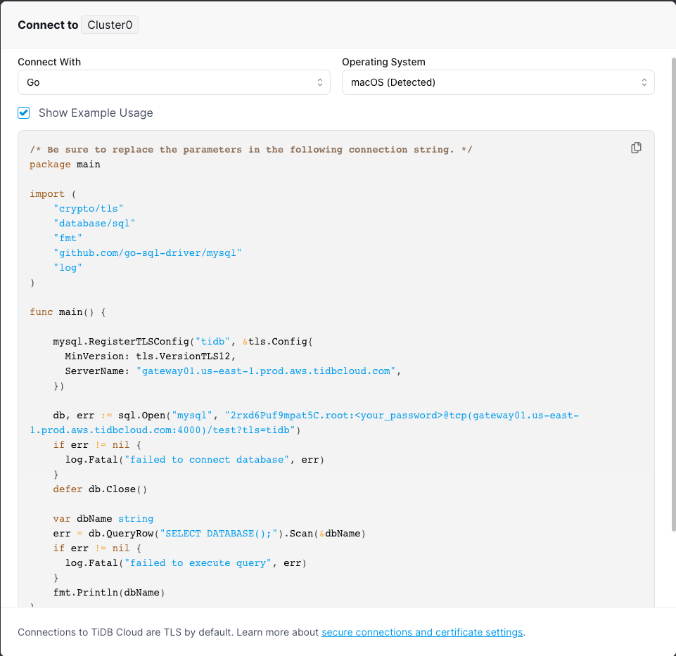

# 文盘Rust --  安全连接 TiDB/Mysql

最近在折腾rust与数据库集成，为了偷懒，选了Tidb Cloud Serverless Tier 作为数据源。Tidb 无疑是近五年来最优秀的国产开源分布式数据库，Tidb Cloud Serverless Tier作为pingcap旗下的云产品方便又经济，这次使用还有一些小惊喜，这个后文在说。硬广时间到这里，咱们说正事儿。

Tidb Cloud Serverless Tier 的使用文档还是很全面的，详细情况请参考[使用 TiDB Cloud (Serverless Tier) 构建 TiDB 集群](https://docs.pingcap.com/zh/tidb/stable/dev-guide-build-cluster-in-cloud#%E7%AC%AC-1-%E6%AD%A5%E5%88%9B%E5%BB%BA%E5%85%8D%E8%B4%B9%E9%9B%86%E7%BE%A4).

集群建立完成后，Tidb Cloud Serverless Tier 有个小功能是可以显示主流客户端以及流行编程语言的连接代码。包括: MysqlCli、MyCli、JDBC、Python、golang以及Nodejs。


嗯？rust 的代码在哪儿？很遗憾没有rust的代码。而且为了安全起见，Tidb Cloud Serverless Tier 貌似只支持安全连接。在查找文档过程中rust 的 数据库驱动和很多orm文档中也没有关于安全详细的描述，不少思路是在issues里面给出的。索性把rust 连接 mysql 主流方式的安全连接代码都记录下来，一来给自己留个备忘，二来给需要的同学做个提示。

一下实例所使用的的标的建表语句如下

```sql
CREATE TABLE IF NOT EXISTS sample (
        id BIGINT NOT NULL ,
        name VARCHAR(128) NOT NULL,
        gender TINYINT NOT NULL,
        mobile VARCHAR(11) NOT NULL,
        create_time DATETIME NOT NULL, 
        update_time DATETIME NOT NULL, 
        PRIMARY KEY(id)
    ) ENGINE=InnoDB DEFAULT CHARSET=utf8;
```

## mysql rust driver

[rust-mysql-simple](https://github.com/blackbeam/rust-mysql-simple),纯 rust 实现的 mysql 驱动。

* 依赖
  
  ```toml
  [dependencies]
  # mysql origin
  mysql = "*"
  ```

* 代码
  
  ```rust
  use chrono::Local;
  use mysql::prelude::*;
  use mysql::*;
  use rbatis::snowflake::new_snowflake_id;
  use serde::Deserialize;
  use serde::Serialize;
  
  pub const TABLE_NAME: &str = "sample";
  
  #[derive(Clone, Debug, Serialize, Deserialize)]
  pub struct BizOrigin {
      pub id: i64,
      pub name: String,
      pub gender: u8,
      pub mobile: String,
      pub create_time: Option<String>,
      pub update_time: Option<String>,
  }
  
  fn main() -> std::result::Result<(), Box<dyn std::error::Error>> {
      let fmt = "%Y-%m-%d %H:%M:%S";
      // 原生方式连接
      let cert_path = std::path::Path::new("/etc/ssl/cert.pem");
      let ssl_opts = SslOpts::default().with_root_cert_path(Some(cert_path));
      let opts = OptsBuilder::new()
          .ip_or_hostname(Some("gateway01.us-east-19.prod.aws.tidbcloud.com"))
          .tcp_port(4000)
          .user(Some("tidbcloudtier.root"))
          .pass(Some("xxxxxxxxxxxx"))
          .ssl_opts(ssl_opts)
          .db_name(Some("test"));
  
      let mut conn_origin = Conn::new(opts)?;
      let (_, cipher_origin): (Value, String) = "SHOW STATUS LIKE 'Ssl_cipher'"
          .first(&mut conn_origin)?
          .unwrap();
      println!(">>>>> Cipher in use from origin: {}", cipher_origin);
  
      let create_statment = format!(
          "
      CREATE TABLE IF NOT EXISTS {} (
          id BIGINT NOT NULL ,
          name VARCHAR(128) NOT NULL,
          gender TINYINT NOT NULL,
          mobile VARCHAR(11) NOT NULL,
          create_time DATETIME NOT NULL, 
          update_time DATETIME NOT NULL, 
          PRIMARY KEY(id)
      ) ENGINE=InnoDB DEFAULT CHARSET=utf8;",
          TABLE_NAME
      );
      conn_origin.query_drop(create_statment)?;
  
      let bizes = vec![
          BizOrigin {
              id: new_snowflake_id(),
              name: "Bob".to_string(),
              gender: 1,
              mobile: "13037777876".to_string(),
              create_time: Some(Local::now().format(fmt).to_string()),
              update_time: Some(Local::now().format(fmt).to_string()),
          },
          BizOrigin {
              id: new_snowflake_id(),
              name: "Jecika".to_string(),
              gender: 0,
              mobile: "13033457876".to_string(),
              create_time: Some(Local::now().format(fmt).to_string()),
              update_time: Some(Local::now().format(fmt).to_string()),
          },
      ];
  
      conn_origin.exec_batch(
          r"insert into sample (id,name,gender,mobile,create_time,update_time) 
      values (:id,:name,:gender,:mobile,:create,:update)",
          bizes.iter().map(|p| -> Params {
              params! {
                  "id"=>p.id,
                  "name"=>p.name.to_owned(),
                  "gender"=>p.gender.to_owned(),
                  "mobile"=>p.mobile.to_owned(),
                  "create"=>p.create_time.as_ref(),
                  "update"=>p.update_time.as_ref()
              }
          }),
      )?;
  
      // Let's select payments from database. Type inference should do the trick here.
      let selected_bizs = conn_origin.query_map(
          "SELECT id,name,gender,mobile,create_time,update_time from sample",
          |(id, name, gender, mobile, create_time, update_time)| BizOrigin {
              id,
              name,
              gender,
              mobile,
              create_time,
              update_time,
          },
      )?;
      println!("selected result {:?}", selected_bizs);
  
      Ok(())
  }
  ```

  代码并不复杂，首先创建SslOpts，指定CA文件的位置；然后使用OptsBuilder 生成链接配置信息；最后创建Connection。后面是执行表创建以及验证链接，最后是对标的 insert 和 select 操作。


## sqlx

[sqlx](https://github.com/launchbadge/sqlx)是纯 Rust 编写的异步 SQL Crate。

* 依赖
  
  ```toml
  [dependencies]
  # sqlx
  sqlx = "0.6.2"
  ```

* 代码
  
  ```rust
  use futures::TryStreamExt;
  use sqlx::mysql::MySqlPoolOptions;
  
  #[tokio::main]
  async fn main() {
      let sqlx_opts = sqlx::mysql::MySqlConnectOptions::new()
          .host("gateway01.us-east-19.prod.aws.tidbcloud.com")
          .port(4000)
          .database("test")
          .username("tidbcloudtier.root")
          .password("xxxxxxxxxxxx")
          .ssl_ca("/etc/ssl/cert.pem");
  
      let pool = MySqlPoolOptions::new()
          .connect_with(sqlx_opts)
          .await
          .unwrap();  

      let mut rows = sqlx::query("select * from sample").fetch(&pool);
      while let Some(row) = rows.try_next().await.unwrap() {
          println!("row is {:?}", row);
      }
  }
  ```

## SeaORM

[SeaORM](https://github.com/SeaQL/sea-orm)是在 sqlx 之上构建的 orm 框架。

* 依赖
  
  ```toml
  [dependencies]
  # SeaORM
  sqlx = "0.6.2"
  sea-orm = { version = "0.10.6", features = [ "sqlx-mysql", "runtime-async-std-native-tls", "macros" ] }
  ```

* 代码
  
  ```rust
  use sea_orm::ConnectionTrait;
  use sea_orm::DbBackend;
  use sea_orm::SqlxMySqlConnector;
  use sea_orm::{FromQueryResult, Statement as sea_statment};
  use sqlx::MySqlPool;
  
  #[derive(Debug, FromQueryResult)]
  pub struct SeaOrmBiz {
      pub id: i64,
      pub name: String,
      pub gender: Option<i8>,
      pub mobile: String,
      pub create_time: chrono::NaiveDateTime,
      pub update_time: chrono::NaiveDateTime,
  }
  
  #[tokio::main]
  async fn main() {
      let sqlx_opts = sqlx::mysql::MySqlConnectOptions::new()
          .host("gateway01.us-east-19.prod.aws.tidbcloud.com")
          .port(4000)
          .database("test")
          .username("tidbcloudtier.root")
          .password("xxxxxxxxx")
          .ssl_ca("/etc/ssl/cert.pem");
  
      let pool = MySqlPool::connect_with(sqlx_opts).await.unwrap();
      let db = SqlxMySqlConnector::from_sqlx_mysql_pool(pool);
  
      let rs = db
          .execute(sea_statment::from_string(
              db.get_database_backend(),
              "select 1 from dual;".to_string(),
          ))
          .await;
      println!(">>>>> Cipher in use from sea_orm:{:?}", rs);
  
      let biz: Vec<SeaOrmBiz> = SeaOrmBiz::find_by_statement(sea_statment::from_sql_and_values(
          DbBackend::MySql,
          r#"SELECT * FROM sample;"#,
          vec![],
      ))
      .all(&db)
      .await
      .unwrap();
      println!(">>>>> selet rs is {:?}", biz);
  }
  ```

SeaOrm 依赖 sqlx。首先构建 sqlx::MySqlConnectOptions 然后根据 MySqlConnectOptions 构建 sqlx::MySqlPool 最后构建 sea_orm::SqlxMySqlConnector 用于与 mysql 通信。

## Rbatis

[rbatis](https://github.com/rbatis/rbatis)

* 依赖
  
  ```toml
  [dependencies]
  # rbatis integration
  rbs = "0.1.13"
  rbatis = "4.0.44"
  rbdc-mysql = "0.1.18"
  ```

* 代码
  
  ```rust
  use rbatis::rbdc::datetime::FastDateTime;
  use rbatis::Rbatis;
  use rbdc_mysql::options::MySqlConnectOptions;
  use rbdc_mysql::{driver::MysqlDriver, options::MySqlSslMode as rbdc_MysqlSslMode};
  use rbs::to_value;
  use serde::{Deserialize, Serialize};
  use std::collections::HashMap;
  
  pub const TABLE_NAME: &str = "sample";
  
  #[derive(Clone, Debug, Serialize, Deserialize)]
  pub struct BizRbatis {
      pub id: Option<i64>,
      pub name: Option<String>,
      pub gender: Option<u8>,
      pub mobile: Option<String>,
      pub create_time: Option<FastDateTime>,
      pub update_time: Option<FastDateTime>,
  }
  rbatis::crud!(BizRbatis {}, TABLE_NAME);
  
  #[tokio::main]
  async fn main() -> std::result::Result<(), Box<dyn std::error::Error>> {
      // rbatis 连接
      let rb = Rbatis::new();
      let opt = MySqlConnectOptions::new()
          .host("gateway01.us-east-19.prod.aws.tidbcloud.com")
          .port(4000)
          .database("test")
          .username("tidbcloudtier.root")
          .password("xxxxxxxxxx")
          .ssl_mode(rbdc_MysqlSslMode::VerifyIdentity)
          .ssl_ca("/etc/ssl/cert.pem");
      rb.init_opt(MysqlDriver {}, opt).unwrap();
      rb.get_pool().unwrap().resize(3);
  
      let sql_show_ssl_cipher = "SHOW STATUS LIKE 'Ssl_cipher'";
  
      let cipher_rbatis = rb
          .fetch_decode::<Vec<HashMap<String, String>>>(sql_show_ssl_cipher, vec![])
          .await;
  
      println!(">>>>> Cipher in use from rbatis: {:?}", cipher_rbatis);
  
      let sql_select_one = format!("select * from {} limit ?;", TABLE_NAME);
      let row = rb
          .fetch_decode::<BizRbatis>(&sql_select_one, vec![to_value!(1)])
          .await;
      println!(">>>>> rbatsis select result={:?}", row);
  
      Ok(())
  }
  ```

首先，新建一个Rbatis struct;构建 rbdc_mysql::options::MySqlConnectOptions (rbdc 相当于java体系里的jdbc，是rbatis的衍生项目);最后通过配置好的 rbdc_mysql::options::MySqlConnectOptions 初始化 Rbatis。

## 后记

在这次实验中笔者也试图使用[Diesel](https://github.com/diesel-rs/diesel)建立 mysql 安全连接，不过在编译的时候失败，未入门先放弃。Diesel 由于开发时间久远，彼时各个数据库的 rust 原生驱动缺失，所以大量才用 c/c++ driver进行构建，这次编译失败也是因为在macos上找不到 mysqlclient 导致。有对 Diesel 强依赖的同学可以继续探索。
再来说说对 SeaOrm 和 Rbatis 的直观感受。SeaOrm 构建实体比较麻烦，如果不是通过工具手工构建实体比较烧脑；实体中包含各种与其他实体的关系；动态sql 可以通过 sea_query 工具包来构建。Rbatis 构建实体心智负担就小很多，一张表一个实体；动态 sql 可以通过 HtmlSql 和 PySql 实现，sql 与代码充分解耦。rbdc 作为 Rbatis 的衍生项目，显然是要做 rust 生态的JDBC。从感觉上来讲 SeaOrm 更像 hibernate；而 Rbatis 是复刻 Mybatis。
数据库是应用程序打交道最多的外部资源，相关话题也很多，有机会再和大家聊聊 rust 与 数据库打交道的更多细节。

咱们下期见。